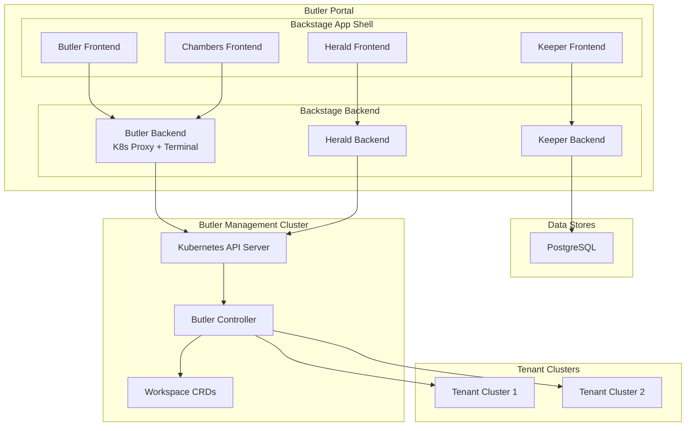

# Architecture

Butler Portal is built on [Backstage](https://backstage.io), an open platform for building developer portals. It runs as a Backstage application extended with Butler-specific plugins that connect to the Butler management cluster and external services.

## System Overview

## Component Roles

### Backstage App Shell

The app shell is the React single-page application that hosts all plugin frontends. It provides navigation, theming, authentication context, and the Backstage service catalog. Plugin frontends register as React components mounted at specific routes within the app shell.

### Butler Backend

The Butler backend (`plugins/butler-backend`) is the central Kubernetes integration point. It provides authenticated access to the Butler management cluster's API server, WebSocket-based terminal proxying for cluster node access, and serves as the data layer for both the Butler frontend and Chambers frontend. Chambers does not have its own backend; it communicates with the management cluster through the Butler backend.

### Plugin Backends

Keeper and Herald each have their own backends that run as Express routers within the Backstage backend process. The Keeper backend manages PostgreSQL storage for artifact metadata. The Herald backend handles Vector configuration compilation and pipeline validation. The Backstage backend provides shared infrastructure for logging, configuration, database connections, and authentication.

### PostgreSQL

PostgreSQL serves as the persistent data store for the Backstage catalog and plugins that require relational storage. The Keeper plugin uses PostgreSQL to store artifact metadata, version history, and approval workflow state.

### Butler Management Cluster

Portal connects to the Butler management cluster through the Butler backend plugin. This connection provides access to Butler CRDs such as TenantCluster, Workspace, and Team resources. The Chambers plugin reads and creates Workspace resources through this connection. The Herald plugin reads cluster topology to determine available telemetry sources.

### Tenant Clusters

Tenant clusters are the Kubernetes clusters provisioned and managed by Butler. Workspaces created through Chambers run on tenant clusters. Pipelines configured through Herald deploy Vector agents to tenant clusters for telemetry collection.

## See Also

- [Plugin System](./plugin-system.md) for details on how Backstage plugins are structured
- [Getting Started](../getting-started/) for connecting Portal to your management cluster
- [Reference](../reference/) for configuration options
