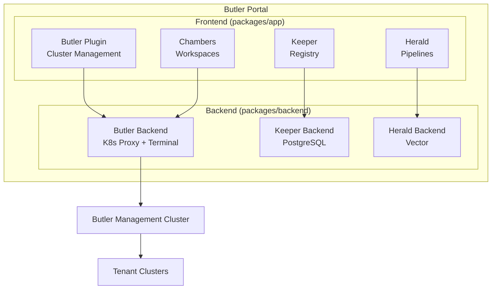

# Butler Portal

Backstage-based Internal Developer Platform with purpose-built plugins for platform engineering.

## Overview

Butler Portal is an Internal Developer Platform (IDP) built on [Backstage](https://backstage.io). It provides a unified interface for platform engineering teams to manage developer environments, infrastructure artifacts, and observability pipelines. Portal extends Backstage with a set of purpose-built plugins that integrate with the broader Butler ecosystem.

While [Butler](/butler/intro) handles Kubernetes cluster provisioning and lifecycle, Portal focuses on the developer experience layer above it. Teams use Portal to provision workspaces, publish and consume infrastructure modules, and configure telemetry routing. Portal runs as a standalone Backstage application and connects to Butler management clusters for cluster management and Kubernetes API access.

The plugin architecture follows a "household staff" naming convention. Each plugin addresses a distinct platform engineering concern and operates as a frontend UI extension within the Backstage app shell, with optional backend services for data storage and external integrations.

## Architecture

## Key Features

- **Cluster Management**: Manage Butler tenant clusters from the Backstage UI with terminal access, addon management, and catalog integration
- **Developer Workspaces**: Private, ephemeral development environments with SSH access, editor deep links (VS Code, JetBrains), and dotfiles synchronization
- **Infrastructure Registry**: Versioned artifact catalog for Terraform modules, Helm charts, and OPA policies with approval workflows and dependency tracking
- **Telemetry Pipelines**: Visual pipeline builder for log, metric, and trace routing powered by Vector, with drag-and-drop source/transform/sink configuration
- **Service Catalog Integration**: Butler resources (clusters, teams, workspaces) appear as Backstage catalog entities alongside your existing services
- **Scaffolder Templates**: Custom Backstage scaffolder actions for provisioning Butler resources through self-service workflows

## Plugins

| Plugin | Package | Description | Status |
|--------|---------|-------------|--------|
| **Butler** | `plugins/butler` | Cluster management, terminal access, addon management | Beta |
| **Chambers** | `plugins/workspaces` | Private dev environments with SSH access, editor deep links, and dotfiles | Beta |
| **Keeper** | `plugins/registry` | IaC artifact registry for Terraform modules, Helm charts, and OPA policies | Beta |
| **Herald** | `plugins/pipeline` | Telemetry routing via Vector for logs, metrics, and traces | Beta |
| **Alfred** | -- | Infrastructure knowledge platform. Indexes docs, runbooks, and incident history. | Coming Soon |
| **Jeeves** | -- | Configuration drift detection and automated remediation | Coming Soon |

## Plugin Packages

The monorepo contains nine plugin packages:

| Package | Type | Plugin |
|---------|------|--------|
| `@internal/plugin-butler` | Frontend | Butler |
| `@internal/plugin-butler-backend` | Backend | Butler |
| `@internal/plugin-workspaces` | Frontend | Chambers |
| `@internal/plugin-registry` | Frontend | Keeper |
| `@internal/plugin-registry-backend` | Backend | Keeper |
| `@internal/plugin-registry-common` | Common | Keeper |
| `@internal/plugin-pipeline` | Frontend | Herald |
| `@internal/plugin-pipeline-backend` | Backend | Herald |
| `@internal/plugin-pipeline-common` | Common | Herald |

## Project Status

| Component | Status |
|-----------|--------|
| Butler Plugin (cluster management) | Beta |
| Chambers (workspaces) | Beta |
| Keeper (IaC registry) | Beta |
| Herald (telemetry pipelines) | Beta |
| Alfred (knowledge platform) | Planned |
| Jeeves (drift remediation) | Planned |
| Backstage Catalog Integration | Beta |
| OIDC / SSO Authentication | Stable |

## Repository

| | |
|---|---|
| Source | [github.com/butlerdotdev/butler-portal](https://github.com/butlerdotdev/butler-portal) |
| Framework | Backstage v1.45.0 |
| Runtime | Node 20+, Yarn 4 |
| License | Apache 2.0 |

## Get Started

- [Overview and Concepts](./overview/) for understanding Portal architecture and terminology
- [Getting Started](./getting-started/) for installation and initial configuration
- [Plugins](./plugins/) for detailed documentation on each plugin
- [Architecture](./architecture/) for how Portal components are deployed and connected
- [Contributing](./contributing/) for development setup and plugin development patterns
