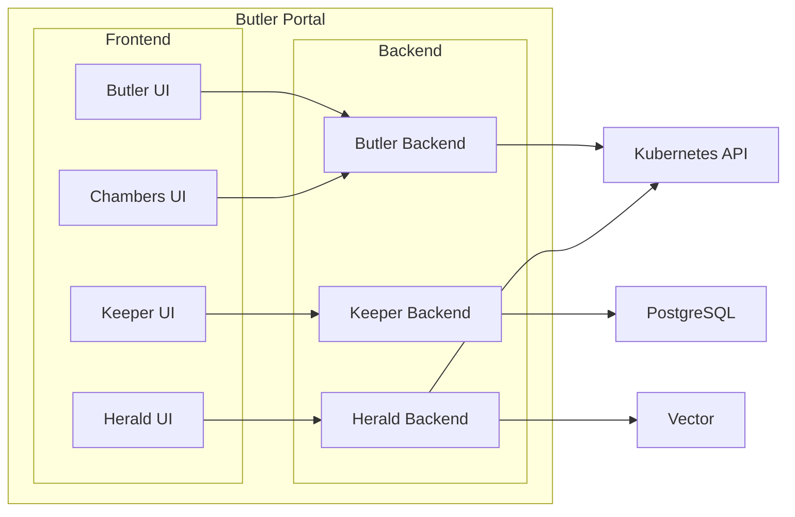

# Portal Concepts and Terminology

This document defines the key terms and concepts used throughout Butler Portal.

## Backstage Fundamentals

### Backstage

[Backstage](https://backstage.io) is an open-source framework for building Internal Developer Platforms, originally created at Spotify and donated to the CNCF. Butler Portal is a Backstage application. It uses Backstage's plugin system, service catalog, and scaffolder to provide platform engineering capabilities.

### App Instance

A Backstage app instance is a deployed Backstage application with a specific set of plugins, catalog entities, and configuration. Butler Portal is one such instance. The app consists of two packages:

- **`packages/app`**: The frontend React application that renders the UI, sidebar navigation, and plugin pages.
- **`packages/backend`**: The Node.js backend that hosts plugin APIs, connects to external services, and manages catalog ingestion.

### Plugin

A plugin is a modular extension that adds functionality to a Backstage instance. Plugins can have up to three parts:

- **Frontend plugin** (`plugins/{name}`): React components that render pages, cards, and widgets in the Backstage UI.
- **Backend plugin** (`plugins/{name}-backend`): Node.js modules that expose API routes, connect to databases, and interact with external systems.
- **Common package** (`plugins/{name}-common`): Shared TypeScript types and permission definitions used by both frontend and backend.

Not every plugin requires all three parts. Some plugins are frontend-only and rely on other plugins' backends for data access.

Butler Portal ships with nine plugin packages across five functional areas (three implemented, two planned). Each plugin registers its own routes, API endpoints, and catalog entity kinds.

### Service Catalog

The Backstage Service Catalog is a centralized registry of software components, APIs, systems, and infrastructure owned by your organization. Catalog entries are called entities.

Portal extends the catalog with Butler-specific entity kinds (workspaces, registry artifacts, pipelines) so they appear alongside your existing services and APIs in a single searchable interface.

### Entity

An entity is a single record in the Service Catalog, described by a YAML descriptor file. Every entity has:

- **`apiVersion`**: The schema version (e.g., `backstage.io/v1alpha1`)
- **`kind`**: The type of entity (e.g., `Component`, `API`, `Resource`)
- **`metadata`**: Name, namespace, labels, annotations
- **`spec`**: Kind-specific fields describing the entity

```yaml
apiVersion: backstage.io/v1alpha1
kind: Component
metadata:
  name: payment-service
  annotations:
    butler.butlerlabs.dev/cluster: prod-cluster
spec:
  type: service
  lifecycle: production
  owner: platform-team
```

Portal plugins register custom entity providers that discover Butler resources (clusters, workspaces, pipelines) and represent them as catalog entities.

### Scaffolder

The Backstage Scaffolder (also called Software Templates) provides self-service workflows for creating new resources. A scaffolder template defines:

- **Parameters**: Form fields the user fills in
- **Steps**: Actions executed in sequence (create repo, apply YAML, register entity)

Portal adds custom scaffolder actions for Butler operations, such as creating a workspace or publishing an artifact to the registry.

```yaml
apiVersion: scaffolder.backstage.io/v1beta3
kind: Template
metadata:
  name: create-workspace
  title: Create Development Workspace
spec:
  type: workspace
  parameters:
    - title: Workspace Details
      properties:
        name:
          type: string
        image:
          type: string
          default: ubuntu:22.04
  steps:
    - id: create
      name: Create Workspace
      action: butler:workspace:create
      input:
        name: ${{ parameters.name }}
        image: ${{ parameters.image }}
```

---

## Portal Architecture

### Plugin Architecture

Butler Portal follows the standard Backstage plugin architecture. Each plugin is a self-contained package with its own dependencies, routes, and API surface.

```
butler-portal/
  packages/
    app/                 # Frontend shell (React)
    backend/             # Backend host (Node.js)
  plugins/
    butler/              # Butler cluster management frontend
    butler-backend/      # Butler K8s proxy and WebSocket terminal
    workspaces/          # Chambers frontend (uses butler-backend for K8s access)
    registry/            # Keeper frontend
    registry-backend/    # Keeper API and PostgreSQL storage
    registry-common/     # Keeper shared types
    pipeline/            # Herald frontend (React Flow + CodeMirror)
    pipeline-backend/    # Herald API and Vector execution
    pipeline-common/     # Herald shared types
```

The frontend shell (`packages/app`) imports and mounts each plugin's routes. The backend host (`packages/backend`) loads each plugin's API router and catalog providers.

### Plugin Communication

Frontend plugins communicate with their backends through the Backstage proxy or direct backend API calls. Backend plugins can communicate with each other through the Backstage backend plugin API. External systems (Butler management clusters, Git providers, artifact registries) are accessed from backend plugins only.



---

## Plugin Concepts

### Butler Plugin

The Butler plugin provides Kubernetes cluster management within Portal. It mirrors the functionality of the standalone Butler Console, with additional Portal-specific features like integrated identity provider configuration and Backstage catalog entity discovery. The frontend (`plugins/butler`) renders cluster dashboards, terminal access, and addon management. The backend (`plugins/butler-backend`) handles WebSocket terminal proxying and authenticated Kubernetes API access.

**Key Concepts:**

| Concept | Description |
|---------|-------------|
| Cluster Dashboard | Overview of tenant clusters with status, nodes, and addon inventory |
| Terminal Access | WebSocket-based terminal session to cluster nodes via the backend proxy |
| Addon Management | Install, upgrade, and remove addons on tenant clusters |
| Catalog Sync | TenantCluster resources discovered as Backstage catalog entities |

### Chambers (Workspaces)

Chambers provides private development environments for engineers. Each workspace is an isolated container or VM with a configured development toolchain. Chambers is a frontend-only plugin (`plugins/workspaces`). It communicates with the Butler management cluster through the Butler backend plugin for Kubernetes API access.

**Key Concepts:**

| Concept | Description |
|---------|-------------|
| Workspace | A running development environment with compute, storage, and network access |
| Dotfiles | User-specific configuration (shell, editor, Git) synced into every workspace on startup |
| Editor Deep Link | A URL that opens the workspace directly in VS Code (via Remote SSH) or JetBrains Gateway |
| SSH Access | Direct terminal access to the workspace over SSH, using keys managed through the Portal UI |
| Workspace Template | A predefined environment configuration (base image, resource limits, preinstalled tools) |

### Keeper (Registry)

Keeper provides a versioned artifact registry for infrastructure-as-code assets. Teams publish, discover, and consume shared modules with governance controls.

**Key Concepts:**

| Concept | Description |
|---------|-------------|
| Artifact | A versioned infrastructure asset: Terraform module, Helm chart, or OPA policy bundle |
| Module | A Terraform module published to the registry with semver versioning |
| Chart | A Helm chart published to the registry, distinct from charts in external Helm repositories |
| Policy | An OPA (Open Policy Agent) policy bundle for infrastructure governance |
| Approval Workflow | A review process required before a new artifact version becomes available for consumption |
| Dependency | A declared relationship between artifacts (e.g., a Terraform module that consumes another module) |

### Herald (Pipeline)

Herald provides telemetry pipeline management using [Vector](https://vector.dev) as the data plane. Teams build pipelines visually and Herald generates Vector configuration.

**Key Concepts:**

| Concept | Description |
|---------|-------------|
| Pipeline | A complete telemetry routing configuration from sources through transforms to sinks |
| Source | An input that collects telemetry data (Kubernetes logs, Prometheus metrics, OTLP traces) |
| Transform | A processing step applied to telemetry data (filter, remap, aggregate, sample) |
| Sink | An output destination for processed telemetry data (Loki, Mimir, Tempo, S3, Kafka) |
| Visual Builder | A drag-and-drop interface for constructing pipelines by connecting sources, transforms, and sinks |
| Pipeline Topology | The directed graph of sources, transforms, and sinks that defines data flow |

### Alfred (Coming Soon)

Infrastructure knowledge platform. Alfred indexes infrastructure state, runbooks, and incident history to provide contextual answers about your platform.

### Jeeves (Coming Soon)

Configuration drift detection and automated remediation. Jeeves continuously compares actual infrastructure state against declared intent and can automatically correct drift or alert operators.

---

## Integration with Butler

### Cluster Discovery

Portal discovers Butler tenant clusters by querying the management cluster's Kubernetes API for `TenantCluster` resources. Each cluster appears as a catalog entity with metadata about its provider, Kubernetes version, addon inventory, and team ownership.

### Team Mapping

Butler Teams map to Backstage ownership. When a Team CRD exists in the management cluster, Portal creates a corresponding Backstage Group entity. Team members appear as Backstage User entities. This mapping ensures that catalog ownership, access controls, and plugin permissions align with Butler's multi-tenancy model.

### Authentication

Portal integrates with Butler's authentication system. If an IdentityProvider CRD is configured in the management cluster, Portal uses the same OIDC provider for Backstage sign-in. Users authenticate once and access both the Butler Console and Portal with consistent identity and group membership.

---

## See Also

- [Architecture](../architecture/) for how Portal components are deployed and connected
- [Plugins](../plugins/) for detailed documentation on each plugin
- [Getting Started](../getting-started/) for installation and initial setup
