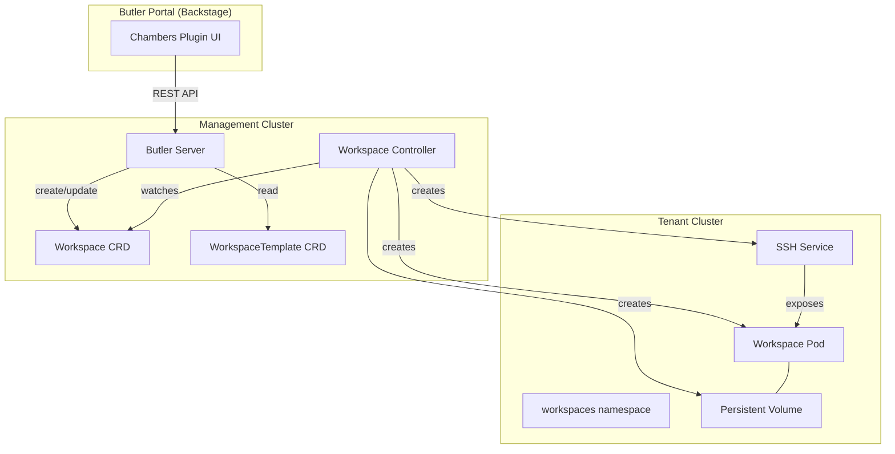

# Chambers

Chambers is Butler Portal's developer workspace plugin (`plugins/workspaces`). It provides private development environments that run as pods on Butler-managed Kubernetes clusters. Developers use Chambers to create, connect to, and manage cloud-based workspaces directly from the Portal UI.

Chambers is a frontend-only plugin. It communicates with the Butler management cluster through the Butler backend plugin (`plugins/butler-backend`) for Kubernetes API access to Workspace and WorkspaceTemplate CRDs.

## Key Features

- **Private development environments** running as pods on tenant clusters managed by Butler
- **SSH access** to workspaces using keys from your user profile or per-workspace overrides
- **Editor deep links** for opening workspaces in VS Code Remote SSH and JetBrains Gateway
- **Multi-repository cloning** with automatic VS Code workspace file generation
- **Dotfiles synchronization** from Git repositories with auto-detected install scripts
- **Environment variable copying** from existing workloads running in the tenant cluster
- **Resource configuration** for CPU, memory, and persistent storage per workspace
- **Workspace lifecycle management** including create, start, stop, and delete operations
- **Idle timeout and auto-stop** to conserve cluster resources when workspaces are inactive
- **Workspace templates** for one-click creation of pre-configured environments
- **Team-scoped access** integrated with Butler's multi-tenancy model

## How Chambers Integrates with Butler

Chambers builds on top of Butler's existing infrastructure. It does not run its own control plane or manage its own clusters. Instead, it uses Butler's Workspace CRD (`butler.butlerlabs.dev/v1alpha1`) and the workspace controller in `butler-controller` to provision and manage workspace pods.

The integration points are:

- **Workspace CRD**: Chambers reads and writes Workspace resources in team namespaces on the management cluster. The workspace controller reconciles these into pods, PVCs, and services on the target tenant cluster.
- **WorkspaceTemplate CRD**: Pre-configured environment definitions stored as Kubernetes resources. Platform admins create cluster-scoped templates visible to all teams. Team admins create team-scoped templates visible to their team.
- **TenantCluster**: Each workspace runs on a TenantCluster that has `spec.workspaces.enabled: true`. The cluster provides the underlying compute, storage, and networking for workspace pods.
- **Team**: Workspaces inherit Butler's team-based multi-tenancy. Users can only create workspaces in clusters belonging to their team. Resource quotas on the TenantCluster's `workspaces` namespace enforce limits.
- **User**: SSH public keys stored in the User CRD (`spec.sshKeys`) are automatically injected into workspace pods for authentication. Users can also specify per-workspace SSH keys.

## Architecture

The following diagram shows how a workspace request flows through the system.

1. A user selects a template and cluster in the Chambers UI, then creates a workspace.
2. The Portal frontend sends a request to Butler Server, which creates a Workspace resource in the team namespace on the management cluster.
3. The workspace controller in `butler-controller` detects the new Workspace and provisions resources on the target tenant cluster: a PVC for persistent storage, a pod running the workspace container image, and a Kubernetes Service for SSH access.
4. The controller clones configured Git repositories, installs dotfiles, and injects SSH public keys into the pod.
5. Once the pod is running and the SSH server is ready, the workspace transitions to the `Running` phase and the user can connect.

All workspace data persists on the PVC. When a workspace is stopped, the pod is deleted but the PVC remains. Starting the workspace again creates a new pod attached to the same PVC.

## Next Steps

- [Concepts](./concepts.md) for detailed explanations of workspaces, templates, SSH keys, dotfiles, and lifecycle states
- [Usage Guide](./usage.md) for step-by-step instructions on creating and managing workspaces
