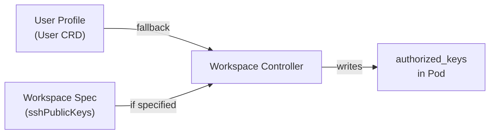
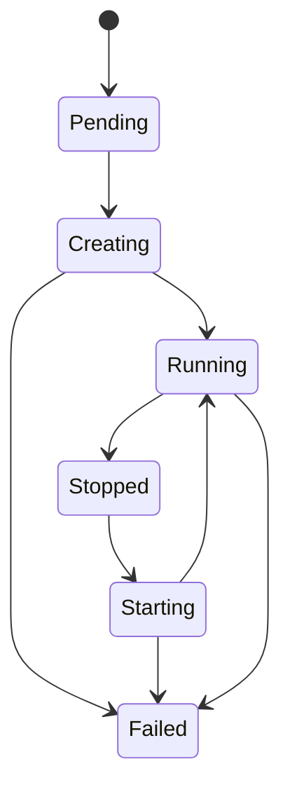

# Chambers Concepts

This page defines the core concepts in Chambers and how they relate to each other.

## Workspace

A **Workspace** is the core unit in Chambers. It represents a private development environment running as a pod inside a Butler-managed tenant cluster.

Each workspace consists of three Kubernetes resources created on the tenant cluster:

| Resource | Purpose | Lifecycle |
|----------|---------|-----------|
| **Pod** | Runs the workspace container image with an SSH server | Created when workspace starts, deleted when workspace stops |
| **PVC** | Persistent storage mounted at `/workspace` | Created once, persists across stop/start cycles |
| **Service** | Exposes the SSH server for remote access | Created when SSH is connected, removed on idle timeout |

The Workspace CRD itself lives on the management cluster in the team namespace. The workspace controller reconciles it by creating the pod, PVC, and service on the tenant cluster's `workspaces` namespace.

Key properties of a workspace:

- **Owner**: The Butler user who created the workspace. Set automatically from the authenticated session.
- **Cluster**: The TenantCluster where the workspace pod runs. Must have `spec.workspaces.enabled: true`.
- **Image**: The container image for the workspace. Includes the SSH server, shell, and base tooling.
- **Repositories**: One or more Git repositories cloned into `/workspace/{repo-name}/` on first creation.
- **Resources**: CPU and memory allocated to the workspace pod.
- **Storage**: Size of the persistent volume (default: 10Gi).

## Workspace Templates

A **WorkspaceTemplate** is a pre-configured workspace definition that enables one-click creation. Templates are data-only resources with no controller reconciliation.

Templates define the container image, default repositories, dotfiles configuration, resource allocation, and storage size. When a user creates a workspace from a template, the template's values are copied into the new Workspace spec. The user can override any value before creation.

### Scope

Templates have two visibility scopes:

| Scope | Created By | Visible To | Namespace |
|-------|-----------|------------|-----------|
| `cluster` | Platform admins | All teams | `butler-system` |
| `team` | Team admins | Members of that team | Team namespace |

### Categories

Templates are organized by category in the UI picker:

| Category | Description |
|----------|-------------|
| `backend` | Server-side development (Go, Java, Python, Rust) |
| `frontend` | Client-side development (React, Vue, Angular) |
| `data` | Data engineering and analytics (Spark, Jupyter, dbt) |
| `devops` | Infrastructure and operations (Terraform, Ansible, kubectl) |
| `custom` | User-defined templates that do not fit other categories |

## SSH Keys

Workspaces are accessed over SSH. Chambers supports two sources of SSH public keys:

1. **User profile keys**: SSH public keys stored in the Butler User CRD at `spec.sshKeys`. These are automatically injected into every workspace the user creates. Users manage their keys through the Portal settings page or via `butlerctl`.

2. **Per-workspace keys**: SSH public keys specified in the Workspace spec at `spec.sshPublicKeys`. These override the user profile keys for that specific workspace.

If neither source has keys, the workspace starts but SSH connections are not possible until keys are added.

The workspace controller writes the public keys to `~/.ssh/authorized_keys` inside the workspace pod. Standard SSH key types are supported: RSA, Ed25519, and ECDSA.

### Key Management Flow



If `spec.sshPublicKeys` is set on the Workspace, those keys are used. Otherwise, the controller reads keys from the owner's User CRD.

## Dotfiles

Chambers supports automatic dotfiles synchronization from a Git repository. When configured, the workspace controller clones the dotfiles repo on first workspace creation and runs an install script.

Configure dotfiles in the Workspace or WorkspaceTemplate spec:

```yaml
dotfiles:
  url: "https://github.com/your-user/dotfiles.git"
  installCommand: "./install.sh"
```

### Install Script Detection

If `installCommand` is not specified, the controller searches the cloned repository for the following files in order:

1. `install.sh`
2. `install`
3. `bootstrap.sh`
4. `bootstrap`
5. `setup.sh`
6. `setup`
7. `Makefile` (runs `make`)

The first match is executed. If no install script is found, the repository is cloned but no install step runs.

### Timing

Dotfiles are installed once during initial workspace creation. The `DotfilesInstalled` condition on the Workspace status tracks whether the installation completed successfully. Stopping and starting a workspace does not re-run the dotfiles install because the home directory persists on the PVC.

## Editor Integration

Chambers generates deep links for connecting to workspaces from desktop editors. The Portal UI displays connection buttons once a workspace reaches the `Running` phase and has an active SSH endpoint.

### VS Code Remote SSH

The Portal generates a `vscode://` URI that opens VS Code with the Remote SSH extension connected to the workspace. The URI includes the SSH endpoint and workspace directory path.

For multi-repository workspaces (more than one entry in `spec.repositories`), the controller generates a `.code-workspace` file automatically. The VS Code deep link opens this workspace file so all repositories appear as folders in the editor.

### JetBrains Gateway

The Portal generates a JetBrains Gateway connection URI that opens the workspace via SSH. This works with any JetBrains IDE that supports Gateway (IntelliJ IDEA, GoLand, PyCharm, WebStorm, and others).

### Neovim

For terminal-based workflows, workspaces support Neovim configuration via `spec.editorConfig`:

| Field | Description |
|-------|-------------|
| `neovimConfigRepo` | Git URL cloned to `~/.config/nvim` |
| `neovimInitLua` | Inline `init.lua` content (ignored if `neovimConfigRepo` is set) |
| `neovimConfigArchive` | Base64-encoded tar.gz extracted to `~/.config/nvim` |

## Environment Variable Copying

Workspaces can inherit environment variables from existing workloads running in the tenant cluster. This is useful for development environments that need the same configuration as a deployed application.

Configure this with `spec.envFrom`:

```yaml
envFrom:
  kind: Deployment
  name: my-api
  namespace: default
  container: app
```

The workspace controller reads the environment variables from the specified container and injects them into the workspace pod. Supported source kinds are `Deployment` and `StatefulSet`.

## Resource Allocation

Each workspace has configurable CPU and memory resources. These are set as both requests and limits on the workspace pod.

| Field | Default | Description |
|-------|---------|-------------|
| `resources.cpu` | `2` | CPU cores allocated to the workspace |
| `resources.memory` | `4Gi` | Memory allocated to the workspace |
| `storageSize` | `10Gi` | Size of the persistent volume |

Resource allocation is constrained by the TenantCluster's workspace quota. The cluster administrator sets aggregate limits in `spec.workspaces.resourceQuota`:

| Quota Field | Default | Description |
|-------------|---------|-------------|
| `maxCPU` | `16` | Maximum total CPU across all workspaces on the cluster |
| `maxMemory` | `32Gi` | Maximum total memory across all workspaces on the cluster |
| `maxStorage` | `100Gi` | Maximum total PVC storage across all workspaces on the cluster |

The workspace controller enforces these quotas by creating a Kubernetes `ResourceQuota` in the tenant cluster's `workspaces` namespace.

## Lifecycle States

A workspace moves through the following phases during its lifecycle:



| Phase | Description |
|-------|-------------|
| **Pending** | The Workspace resource has been created and is awaiting reconciliation by the controller. |
| **Creating** | The controller is provisioning tenant-side resources: PVC, pod, SSH keys, repository cloning, and dotfiles installation. |
| **Running** | The workspace pod is running and the SSH server is ready for connections. |
| **Starting** | A previously stopped workspace is resuming. The controller is creating a new pod and attaching it to the existing PVC. |
| **Stopped** | The workspace pod has been deleted (manually or by auto-stop). The PVC persists with all workspace data. |
| **Failed** | A terminal error occurred during provisioning or execution. Check the Workspace conditions for details. |

### Status Conditions

The Workspace status includes fine-grained conditions that track individual provisioning steps:

| Condition | Description |
|-----------|-------------|
| `PVCReady` | The persistent volume claim is created and bound |
| `PodReady` | The workspace pod is created and running |
| `RepositoryCloned` | All configured Git repositories have been cloned |
| `DotfilesInstalled` | The dotfiles install script completed |
| `SSHReady` | The SSH server is accessible |
| `Ready` | The workspace is fully operational |

### Idle Timeout and Auto-Stop

Workspaces have two inactivity mechanisms:

- **Idle timeout** (`spec.idleTimeout`, default: 4 hours): After this duration from the last connect time, the SSH service is removed. The pod and PVC continue to run. Connecting again creates a new SSH service.
- **Auto-stop** (`spec.autoStopAfter`, default: 8 hours): After this duration from the last SSH disconnect, the workspace pod is deleted. The PVC persists. Set to `0` to disable auto-stop.

### Auto-Delete

The TenantCluster's `spec.workspaces.autoDeleteAfter` setting (default: 720 hours / 30 days) deletes stopped workspaces and their PVCs after the specified duration. This prevents storage from accumulating from abandoned workspaces.
