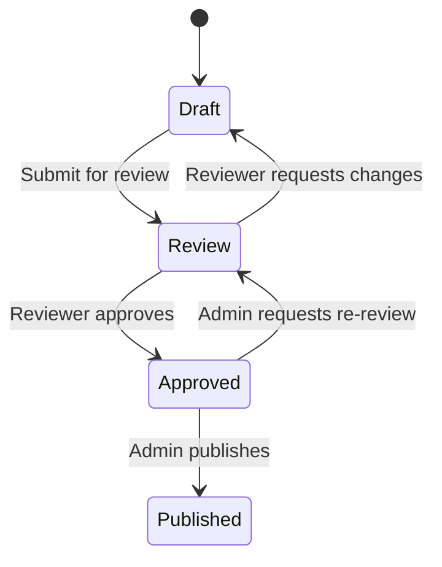

# Concepts

This page defines the core concepts in Keeper. Understanding these terms helps you navigate the registry and work with artifacts effectively.

## Artifact

An **artifact** is a versioned infrastructure component stored in Keeper. Each artifact has a unique name within its owning team, a type, a description, and one or more versions.

An artifact represents the component itself across its full lifecycle. Individual releases of that component are tracked as versions (see below).

Every artifact has the following metadata:

| Field | Description |
|-------|-------------|
| **Name** | Unique identifier within the team scope (e.g., `vpc-module`, `monitoring-chart`) |
| **Type** | One of the supported artifact types (Terraform module, Helm chart, OPA policy, Backstage template) |
| **Team** | The Butler team that owns this artifact |
| **Description** | Human-readable summary of what the artifact provides |
| **Created** | Timestamp when the artifact was first registered |
| **Latest Version** | The most recent published version |

## Artifact Types

Keeper supports four artifact types. The type determines how the artifact is packaged, validated, and consumed.

### Terraform Module

A reusable Terraform module that encapsulates infrastructure resources. Consumers reference published modules as a `module` source in their Terraform configurations. Keeper validates that the module includes the expected file structure (`main.tf`, `variables.tf`, `outputs.tf`).

### Helm Chart

A packaged Kubernetes application described by a Helm chart. Published charts can be consumed through standard Helm install commands, Flux HelmReleases, or Butler TenantAddon definitions. Keeper validates the `Chart.yaml` and expected chart structure.

### OPA Policy

An Open Policy Agent policy bundle containing Rego policy files. These policies enforce governance rules through OPA Gatekeeper, Conftest, or CI policy checks. Keeper validates that the bundle contains valid Rego files and a `policy.yaml` manifest.

### Backstage Template

A Backstage scaffolder template that enables self-service resource creation through the Portal UI. Templates define parameters, steps, and outputs that guide users through provisioning workflows. Keeper validates the `template.yaml` structure.

## Versions

Every artifact release is tracked as a **version**. Versions follow [semantic versioning](https://semver.org/) (semver) with the format `MAJOR.MINOR.PATCH`.

### Versioning Rules

- **MAJOR** increments signal breaking changes to the artifact's interface (e.g., removed variables, changed chart values schema).
- **MINOR** increments add new functionality in a backward-compatible manner.
- **PATCH** increments contain backward-compatible bug fixes.
- Pre-release identifiers (e.g., `1.2.0-rc.1`) are supported for testing versions that have not yet been approved for general use.

### Immutability

Once a version reaches the **Published** state, it is immutable. You cannot modify the contents or metadata of a published version. This guarantees that consumers always get the exact artifact they reference. To make changes, you publish a new version.

### Version Metadata

Each version carries:

| Field | Description |
|-------|-------------|
| **Version** | Semver string (e.g., `1.3.0`) |
| **Status** | Current approval state (Draft, Review, Approved, Published) |
| **Changelog** | Description of changes since the previous version |
| **Author** | The user who created this version |
| **Created** | Timestamp when the version was uploaded |
| **Published** | Timestamp when the version reached Published state (if applicable) |
| **Reviewers** | Users who reviewed and/or approved this version |

## Approval Workflow

Keeper enforces a promotion workflow that governs how artifact versions move from creation to general availability. Every version progresses through four states in order.

### Draft

The initial state when a version is created. The artifact contents and metadata can still be modified. Only the owning team's operators and admins can see draft versions.

In the Draft state, you can:
- Upload or replace artifact contents
- Edit the changelog and metadata
- Submit the version for review

### Review

The version is ready for peer review. A team member with the operator or admin role (who is not the author) reviews the artifact contents, configuration, and changelog.

During Review, reviewers can:
- Inspect the artifact contents and diff against previous versions
- Approve the version, moving it to Approved
- Request changes, returning it to Draft with review comments

### Approved

The version has passed review and is waiting to be published. Only team admins can transition a version from Approved to Published.

From Approved, admins can:
- Publish the version, making it available to all consumers
- Send it back to Review if further changes are needed

### Published

The version is finalized, immutable, and available for consumption. Published versions appear in search results and can be referenced by Terraform configurations, Helm installs, and other consumers.

Published versions cannot be modified or reverted to a previous state. If an issue is found, you create a new version with the fix.

## Teams and Ownership

Keeper uses Butler's `Team` CRD as the ownership boundary for artifacts. Every artifact belongs to exactly one team.

### How Team Scoping Works

When you publish an artifact, you select the Butler team that owns it. The artifact lives within that team's scope, and the team's membership and roles govern who can manage it.

- **Artifact names are unique per team.** Two different teams can each have an artifact named `vpc-module`, but a single team cannot have two artifacts with the same name.
- **Ownership is permanent.** Once an artifact is assigned to a team, it cannot be transferred to a different team. This prevents broken references in consuming configurations.
- **Visibility is global.** All Portal users can browse and search published artifacts regardless of team membership. This encourages reuse across the organization. However, only members of the owning team can create versions, submit reviews, or publish.

### Role Mapping

Team roles from the Butler `Team` CRD map to Keeper permissions:

| Action | Admin | Operator | Viewer |
|--------|:-----:|:--------:|:------:|
| Browse and search published artifacts | Yes | Yes | Yes |
| Consume published artifacts | Yes | Yes | Yes |
| Create new artifacts | Yes | Yes | No |
| Upload new versions | Yes | Yes | No |
| Submit for review | Yes | Yes | No |
| Review and approve versions | Yes | Yes | No |
| Publish approved versions | Yes | No | No |
| Delete artifacts | Yes | No | No |

## Registry Backend

Keeper stores all artifact metadata, version records, and approval history in a PostgreSQL database. The backend runs as part of the Backstage application and connects to PostgreSQL through the standard Backstage database configuration.

### Schema Migrations

The registry backend manages its own database schema using versioned migrations. Migrations run automatically when the backend starts. Each migration is idempotent, so restarts and rolling deployments are safe.

The migration system:
- Creates the required tables on first run (`artifacts`, `artifact_versions`, `approval_records`, `artifact_tags`)
- Applies incremental schema changes as the plugin evolves
- Tracks applied migrations in a `keeper_migrations` table to avoid re-running completed steps

### Data Model

The backend stores these primary entities:

| Table | Purpose |
|-------|---------|
| `artifacts` | Artifact metadata: name, type, team, description, created timestamp |
| `artifact_versions` | Version records: semver, status, changelog, author, timestamps |
| `approval_records` | Approval workflow history: reviewer, action (approve/reject/request changes), comments, timestamp |
| `artifact_tags` | Free-form tags for search and categorization |

### Storage

Artifact contents (the actual files) are stored as binary blobs associated with each version record. The backend handles compression and deduplication. For large deployments, the backend can be configured to use an external object store (S3-compatible) instead of storing blobs in PostgreSQL.

## See Also

- [Overview](./README.md) for a high-level introduction to Keeper
- [Usage Guide](./usage.md) for step-by-step workflows
- [Butler Teams](/butler/reference/crds/team) for details on the Team CRD
